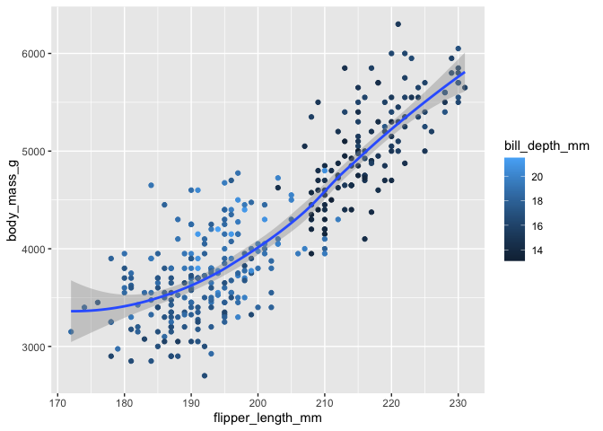
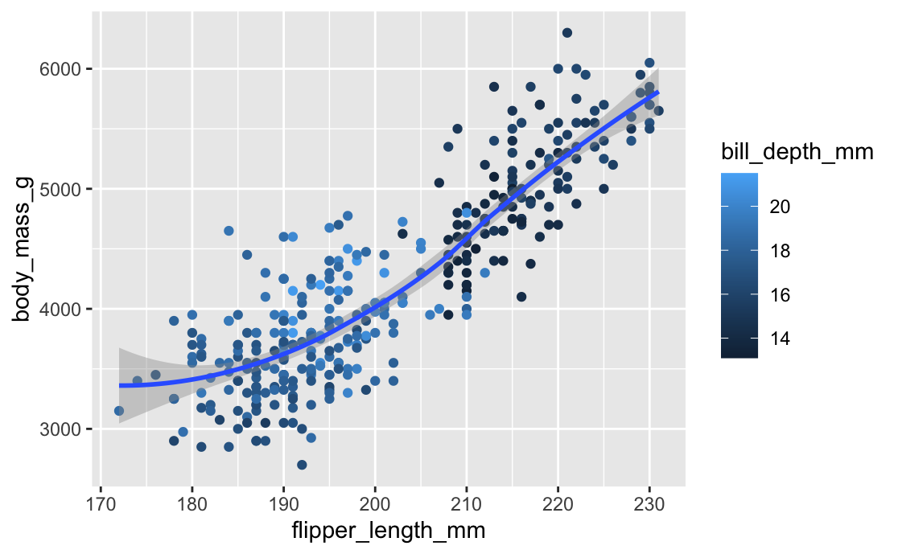

# Homework 03

# Base R and R Basics

HINT: Remember that you can get help on any function by typing
`?`(function name). For instance, `?rnorm` gives help on the `rnorm()`
function.

## Creating and naming variables

``` r
rm(list=ls())
```

1.  Create a variable called `x` and use it to store the result of the
    calculation `(3*(4+2)`.

    Here we are going to use a command to create a variable called x
    that is the discrete constant 18

    ``` r
    x <- 18
    ```

2.  Calculate the product of `x` (from the above question) times π.

    Now that we have the variable x, we can use that variable in
    calculations.

    ``` r
    x*pi
    ```

        [1] 56.54867

    The above command returns the result 56.54867. R has some embedded
    values and pi is one of these values.

3.  Use the `getwd()` function to show your current working directory.
    Is that a good working directory, and what program do you think set
    it that way?

    If we want to see where on our computer we are are working, we use
    the following function to see the current filepath.

    ``` r
    getwd()
    ```

        [1] "/Users/sarinamitchell/SP_2023_Coursework/MICRO_575/Homework_03"

    The current output of this function is
    “/Users/sarinamitchell/SP_2023_Coursework/MICRO_575”. This directory
    is one I specified for this course within the base user on my
    computer, which is a good directory (not on desktop). I set this
    directory up via RStudio and it can also be set through terminal
    directly. \`\`\`

## Vectors

1.  Use the `c()` function to create a vector of numbers.

    Here, we create a vector of numbers that are the first five values
    of Lucas numbers.

    ``` r
    Lucas_numbers <- c(2,1,3,4,7)
    ```

    Executing the function will produce a value called Lucas_numbers in
    our Global Environment which consists of 5 numbers.

2.  Use the `c()` function to create a vector of characters.

    Here, we create a vector of characters, aka a string of text. In
    this instance, the elements of the character vector happen to be the
    letters in my name.

    ``` r
    character <- c("S", "a", "r", "i", "n", "a")
    ```

    Other helpful tips: If we are unsure which type of vector we created
    we can look at the format of the vectors we have made.

    ``` r
    typeof(character)
    ```

        [1] "character"

    ``` r
    typeof(Lucas_numbers)
    ```

        [1] "double"

    Notice that the character vector we created is specified as a
    character vector while our numeric vector is a double vector, which
    stands for “double precision numeric values.”

3.  Use the `:` implicit function to create a vector of integers from 1
    to 10.

    The implicit function can be used to create a vector of integers
    from 1 to 10.

    ``` r
    integers_1_to_10 <- 1:10
    ```

    Again, we can check this vector’s type to confirm it is an integer
    vector.

    ``` r
    typeof(integers_1_to_10)
    ```

        [1] "integer"

4.  Explain *why* the following code returns what it does. Also address
    whether you think this was a good decision on the part of the
    designers of R?

    The below code is saying, create an integer vector “v1” containing
    the values 1, 2, and 3. The second line says create a numeric vector
    “v2” containing the values 1, 2, 3, 4. The third line says add the
    elements in “v1” and “v2.” Note that the number of elements in each
    vector is not equal. Running the code returns the values 2 (1+1), 4
    (2+2), 6 (3+3), and 5 (3+x). Essentially, here R is treating v1 and
    v2 as scalar vectors; however, R is repeating the value of the first
    element in v1 (1) instead of treating the element as empty. I think
    this was a terrible decision on the designers of R and that it would
    be much more intuitive to treat the addition of vectors with uneven
    elements as empty.

``` r
v1 <- 1:3
v2 <- c(1:4)
v1 + v2
```

    [1] 2 4 6 5

To check that my above rationale is correct, I will perform a similar
set of functions with different values. In the below instance, v1+v2
yields 5 (2+3), 7 (3+4), 9 (5+4), and 8 (2+6). I am confident that the
elements of the shorter vector is being recycled.

``` r
v1 <- 2:4
v2 <- c(3:6)
v1 + v2
```

    [1] 5 7 9 8

6.  Explain what the following code does. It may be helpful to reference
    the answer to the previous question:

``` r
c(1, 5, 9) + 3
```

    [1]  4  8 12

The above code is adding three to each of the elements in the vector.
However, the reason that this is occurring is that R is actually saying
“I’m going to make a vector of a single element that is the value three
and then I’m going to recycle that vector to perform the calculation on
the vector of longer length.”

6.  Remove (delete) every variable in your workspace.

    Some other codes that are helpful at this point are removing
    variables we don’t want and also clearing out our Global
    Environment.

    To remove a specific variable:

    ``` r
    rm (x)
    ```

    To clear the Global Environment:

    ``` r
    rm(list=ls())
    ```

## Graphics

1.  Load the tidyverse package. **NOTE:** Be sure to use the chunk
    option `message=FALSE` to suppress the messages that tidyverse
    prints when loaded. These messages are useful in the

``` r
library(tidyverse)
```

2.  Recreate the visualization of `body_mass_g` to `flipper_length_mm`,
    from the penguins data set, that is shown in question 8 of section
    2.2.5 of [R4DS](https://r4ds.hadley.nz/data-visualize).

``` r
library(tidyverse)
library(palmerpenguins)
glimpse(penguins)
```

    Rows: 344
    Columns: 8
    $ species           <fct> Adelie, Adelie, Adelie, Adelie, Adelie, Adelie, Adel…
    $ island            <fct> Torgersen, Torgersen, Torgersen, Torgersen, Torgerse…
    $ bill_length_mm    <dbl> 39.1, 39.5, 40.3, NA, 36.7, 39.3, 38.9, 39.2, 34.1, …
    $ bill_depth_mm     <dbl> 18.7, 17.4, 18.0, NA, 19.3, 20.6, 17.8, 19.6, 18.1, …
    $ flipper_length_mm <int> 181, 186, 195, NA, 193, 190, 181, 195, 193, 190, 186…
    $ body_mass_g       <int> 3750, 3800, 3250, NA, 3450, 3650, 3625, 4675, 3475, …
    $ sex               <fct> male, female, female, NA, female, male, female, male…
    $ year              <int> 2007, 2007, 2007, 2007, 2007, 2007, 2007, 2007, 2007…

``` r
ggplot(data = penguins, 
       mapping =aes(x = flipper_length_mm, y = body_mass_g)) +
  geom_point(aes(color = bill_depth_mm)) +
  geom_smooth()
```



The code is saying use ggplot to plot out values from the
dataset penguins by mapping the x-axis as the flipper length and the
y-axis as the body mass with bill depth values as the color scale. We
are performing aesthetic mapping, this means we are creating a visual
image of our variables with reasonable scales and labels. The
geom_smooth is giving the dark grey model fit of the data points and the
geom_point is saying plot the values as points (we could change the size
of the points if we wanted to.

2.  Explain why each aesthetic is mapped at the level that it is (i.e.,
    at the global level, in the `ggplot()` function call, or at the geom
    level, in the `geom_XXX()` function call). Note: A lot of different
    options will work, but some options are clearly better than others.

In global mapping you are mapping every aesthetic to every geom but in
local mapping you can specify to only map to a certain geom. Basically,
this means when you map in the global level you are changing all of the
values at the same time. But, when you map at the geom level you can
work with a subset of data.
