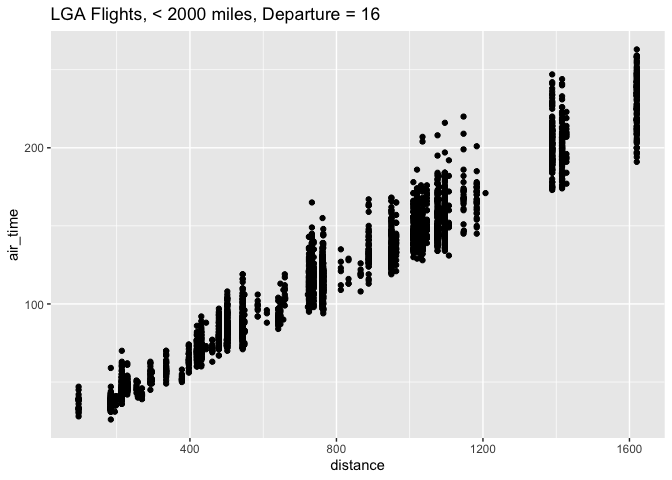
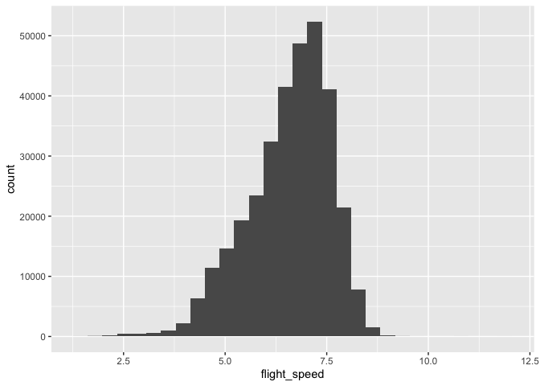

# Hmk_04 template: Data frames and data wrangling

Please read the entire [R for Data
Science](https://r4ds.hadley.nz/data-transform) before you do this
homework.

This homework relies on the `nycflights13` package, which contains
several data frames, including `airlines`, `airports`, `flights`,
`planes`, and `weather`. Loading `nycflights13`
(`library(nycflights13)`) puts all of these data frames on the search
path.

## Installing data packages

Remember that any package needs to be installed only once (per version
of R), but needs to be loaded every time we start a new R session.

To install `nyclflights13`, use `install.packages("nycflights13")` (with
quotation marks). To load it, use `library(nycflights13)`.

# Question 1: filtering

Make a plot of air time as a function of distance (air time on the y
axis, distance on the x axis) for all flights that meet the following
criteria:

- originate from LaGuardia airport (“LGA”)
- departed on the 16th of the month
- have a flight distance of less than 2000

First, we load the proper data set.

``` r
library(tidyverse)
```

    ── Attaching core tidyverse packages ──────────────────────── tidyverse 2.0.0 ──
    ✔ dplyr     1.1.2     ✔ readr     2.1.4
    ✔ forcats   1.0.0     ✔ stringr   1.5.0
    ✔ ggplot2   3.4.3     ✔ tibble    3.2.1
    ✔ lubridate 1.9.2     ✔ tidyr     1.3.0
    ✔ purrr     1.0.2     
    ── Conflicts ────────────────────────────────────────── tidyverse_conflicts() ──
    ✖ dplyr::filter() masks stats::filter()
    ✖ dplyr::lag()    masks stats::lag()
    ℹ Use the conflicted package (<http://conflicted.r-lib.org/>) to force all conflicts to become errors

``` r
library(nycflights13)
```

Next, we can look at this data using the glimpse function.

``` r
glimpse(flights)
```

    Rows: 336,776
    Columns: 19
    $ year           <int> 2013, 2013, 2013, 2013, 2013, 2013, 2013, 2013, 2013, 2…
    $ month          <int> 1, 1, 1, 1, 1, 1, 1, 1, 1, 1, 1, 1, 1, 1, 1, 1, 1, 1, 1…
    $ day            <int> 1, 1, 1, 1, 1, 1, 1, 1, 1, 1, 1, 1, 1, 1, 1, 1, 1, 1, 1…
    $ dep_time       <int> 517, 533, 542, 544, 554, 554, 555, 557, 557, 558, 558, …
    $ sched_dep_time <int> 515, 529, 540, 545, 600, 558, 600, 600, 600, 600, 600, …
    $ dep_delay      <dbl> 2, 4, 2, -1, -6, -4, -5, -3, -3, -2, -2, -2, -2, -2, -1…
    $ arr_time       <int> 830, 850, 923, 1004, 812, 740, 913, 709, 838, 753, 849,…
    $ sched_arr_time <int> 819, 830, 850, 1022, 837, 728, 854, 723, 846, 745, 851,…
    $ arr_delay      <dbl> 11, 20, 33, -18, -25, 12, 19, -14, -8, 8, -2, -3, 7, -1…
    $ carrier        <chr> "UA", "UA", "AA", "B6", "DL", "UA", "B6", "EV", "B6", "…
    $ flight         <int> 1545, 1714, 1141, 725, 461, 1696, 507, 5708, 79, 301, 4…
    $ tailnum        <chr> "N14228", "N24211", "N619AA", "N804JB", "N668DN", "N394…
    $ origin         <chr> "EWR", "LGA", "JFK", "JFK", "LGA", "EWR", "EWR", "LGA",…
    $ dest           <chr> "IAH", "IAH", "MIA", "BQN", "ATL", "ORD", "FLL", "IAD",…
    $ air_time       <dbl> 227, 227, 160, 183, 116, 150, 158, 53, 140, 138, 149, 1…
    $ distance       <dbl> 1400, 1416, 1089, 1576, 762, 719, 1065, 229, 944, 733, …
    $ hour           <dbl> 5, 5, 5, 5, 6, 5, 6, 6, 6, 6, 6, 6, 6, 6, 6, 5, 6, 6, 6…
    $ minute         <dbl> 15, 29, 40, 45, 0, 58, 0, 0, 0, 0, 0, 0, 0, 0, 0, 59, 0…
    $ time_hour      <dttm> 2013-01-01 05:00:00, 2013-01-01 05:00:00, 2013-01-01 0…

Now, we can create an object that consists of flights filtered to only
contain the flights that originate from LaGuardia, departed on the 16th
of the month, and have a flight distance of less than 2000.

``` r
Flights_LGA_Day16_2000m <- flights |>
  filter(origin == "LGA", day == 16, distance < 2000) 
```

Now, we use ggplot to plot the filtered flights as a function of
distance with air time on the y axis and distance on the x axis.

``` r
ggplot(Flights_LGA_Day16_2000m, aes(x = distance, y = air_time)) + 
  geom_point() + 
  ggtitle("LGA Flights, < 2000 miles, Departure = 16")
```

    Warning: Removed 75 rows containing missing values (`geom_point()`).



# Question 2: dealing with NAs

Make a data frame of all of the rows of `flights` that have values for
*both* `arr_time` and `dep_time` - that is, neither of those values are
`NA`.

We can make a data frame for all flights that contain information on
their arrival time and departure time by omitting the flights that have
no specified values for these variables and then print the resulting
tibble. Note, we want to use the filter function here and not na.omit
because the omit function is in base R, while the filter function is
meant for tidyverse.

``` r
Has_Arrival_and_Departure <- flights |> 
  filter(!is.na(arr_time), !is.na(dep_time))
print(Has_Arrival_and_Departure)
```

    # A tibble: 328,063 × 19
        year month   day dep_time sched_dep_time dep_delay arr_time sched_arr_time
       <int> <int> <int>    <int>          <int>     <dbl>    <int>          <int>
     1  2013     1     1      517            515         2      830            819
     2  2013     1     1      533            529         4      850            830
     3  2013     1     1      542            540         2      923            850
     4  2013     1     1      544            545        -1     1004           1022
     5  2013     1     1      554            600        -6      812            837
     6  2013     1     1      554            558        -4      740            728
     7  2013     1     1      555            600        -5      913            854
     8  2013     1     1      557            600        -3      709            723
     9  2013     1     1      557            600        -3      838            846
    10  2013     1     1      558            600        -2      753            745
    # ℹ 328,053 more rows
    # ℹ 11 more variables: arr_delay <dbl>, carrier <chr>, flight <int>,
    #   tailnum <chr>, origin <chr>, dest <chr>, air_time <dbl>, distance <dbl>,
    #   hour <dbl>, minute <dbl>, time_hour <dttm>

## filtering NAs

`ggplot()` will automatically remove NA values from the plot, as you may
have seen in question 1, but it emits a warning message about that. Of
course you could silence the warning message using [chunk
options](https://bookdown.org/yihui/rmarkdown-cookbook/chunk-options.html),
but how could you prevent them from appearing in the first place?

To remove NA’s pre-plotting, we could just filter the flight data as
done above, but for all variables.

# Question 3: adding columns

Create a data frame of average flight speeds, based on `air_time` and
`distance`. Make either a histogram or a density plot of the data. If
you like, you may break the data out (e.g. by airline, or some other
variable) in a way that you think makes sense.

To create a data frame of average flight speeds, I can mutate the
flights database to add a column. Then, I can plot these values as a
histogram.

``` r
average_flight_speed = flights |> mutate(flight_speed = distance / air_time)
print(average_flight_speed)
```

    # A tibble: 336,776 × 20
        year month   day dep_time sched_dep_time dep_delay arr_time sched_arr_time
       <int> <int> <int>    <int>          <int>     <dbl>    <int>          <int>
     1  2013     1     1      517            515         2      830            819
     2  2013     1     1      533            529         4      850            830
     3  2013     1     1      542            540         2      923            850
     4  2013     1     1      544            545        -1     1004           1022
     5  2013     1     1      554            600        -6      812            837
     6  2013     1     1      554            558        -4      740            728
     7  2013     1     1      555            600        -5      913            854
     8  2013     1     1      557            600        -3      709            723
     9  2013     1     1      557            600        -3      838            846
    10  2013     1     1      558            600        -2      753            745
    # ℹ 336,766 more rows
    # ℹ 12 more variables: arr_delay <dbl>, carrier <chr>, flight <int>,
    #   tailnum <chr>, origin <chr>, dest <chr>, air_time <dbl>, distance <dbl>,
    #   hour <dbl>, minute <dbl>, time_hour <dttm>, flight_speed <dbl>

``` r
ggplot(average_flight_speed, aes(x = flight_speed)) + 
  geom_histogram() 
```

    `stat_bin()` using `bins = 30`. Pick better value with `binwidth`.

    Warning: Removed 9430 rows containing non-finite values (`stat_bin()`).


