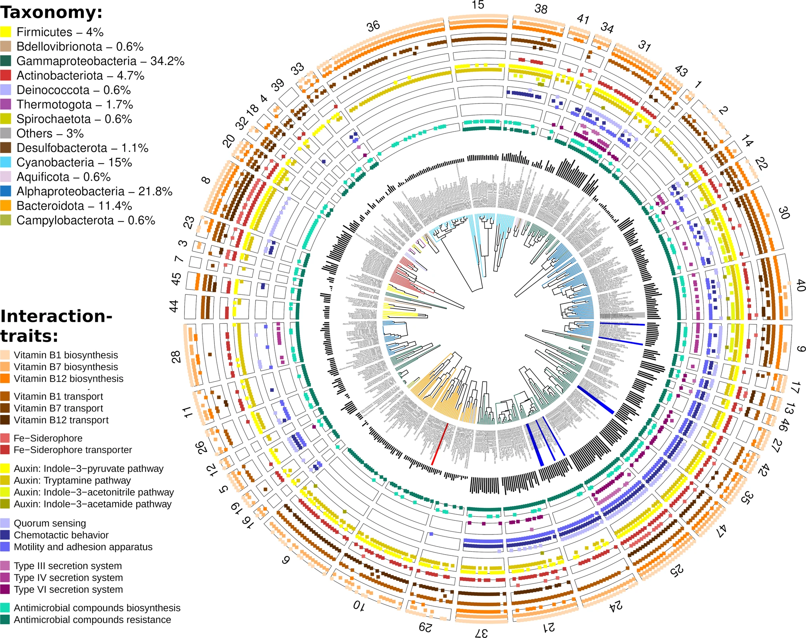
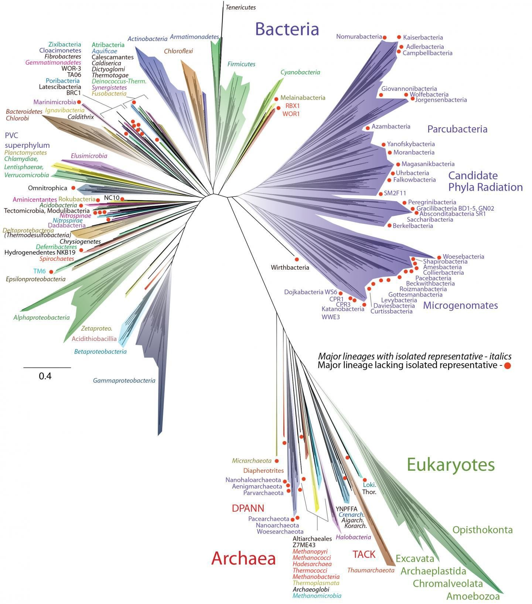

# Successful and Unsuccessful Figures

## Unsuccessful Figure:

Figure from: Zoccarato, L., Sher, D., Miki, T., Segrè, D. and Grossart,
H.P., 2022. A comparative whole-genome approach identifies bacterial
traits for marine microbial interactions. *Communications
Biology*, *5*(1), p.276.

**Why is this figure unsuccessful?**

- Data dump: does not tell a readily apparent story

- Axis are omitted from histogram, and the circular presentation of
  histogram works against seeing differences between groups

- Confusing ordering of groups

- Underlying data not readily available

- Impossible to read the labels of genomes

- Tree lengths/branches impossible to distinguish

- Similar colors between interaction-traits and taxonomy cause human
  perception to make connections that are not intended.

- Color scale: not possible to distinguish what data belongs to

- Interaction traits colored with sequential color scale; however,
  information is not representative of a quantitative gradient. Human
  perception encourages us to see a relationship gradient that isn’t
  there.

- Color as a highlight: chosen highlight colors do not equally draw eye
  (red vs. grey vs. blue) leading to an unnecessary emphasis of negative
  traits

## Successful Figure:

Figure from: Hug, L.A., Baker, B.J., Anantharaman, K., Brown, C.T.,
Probst, A.J., Castelle, C.J., Butterfield, C.N., Hernsdorf, A.W., Amano,
Y., Ise, K. and Suzuki, Y., 2016. A new view of the tree of
life. *Nature microbiology*, *1*(5), pp.1-6.

**Why is this figure successful?**

- Illustrates a massive amount of data in coherent manner

- Aesthetics: Concise, arbitrary color scheme to reduce human influence
  on inferences

- Tells a story: Unrooted to evaluate diversity, star burst of time,
  isolated versus lacking isolated representative

- Who is looking at it and why? Readily accessible to wide range of
  audience increasing public visibility

- Underlying data readily available
